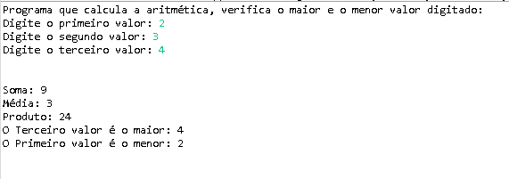

# AritmeticaMenorMaiorEmJava

**Programa que calcula aritmética e verifica qual foi o valor maior e o menor**

   

Autor: Erick Leite Freire 
Criado em: 03-01-2024 
Site: [Erick Freire](https://www.erickfreire.com.br) 
